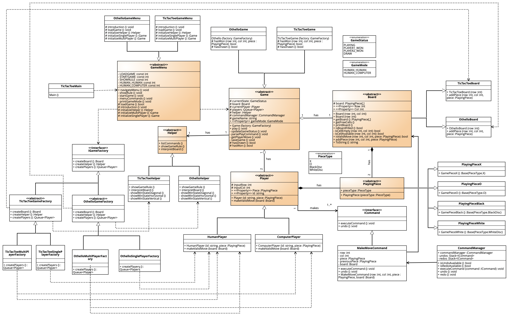
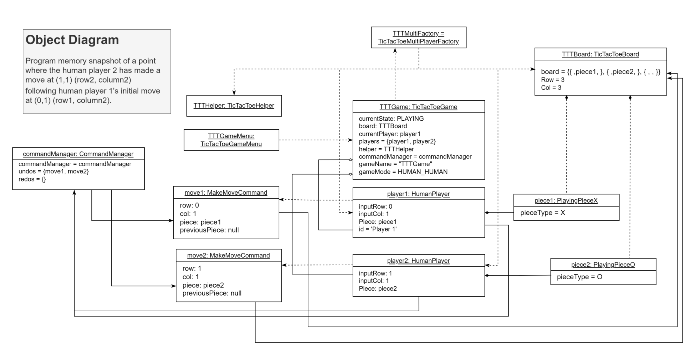
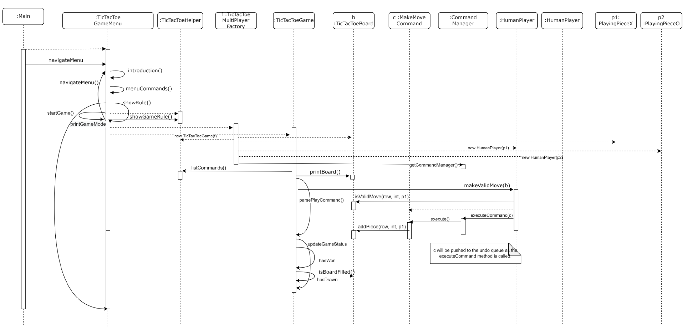

# tictactoe-console-game

##  Project Description

This project is to develop an extensible and reusable framework for two-player tic-tac-toe board game. The rules of the game are commonly known and are defined as follows:

> Two players take turns replacing an `X` or an `O` piece on a 3x3 board. The first player who creates a line of three `X`'s in a row or three `O`'s in a row (horizontally, vertically, or diagonally) wins the game.

## Project Requirements

- The design should extract as many commonalities as possible from the different games so that the framework is extensible and reusable for a wide variety of board games.
- The system should cater for different modes of play, including:
    - Human vs Human
    - Computer vs Human
- With human players, the system must check the validity of moves as they are entered. With computer players, the system can randomly select a valid move.
- Games can be played from start to finish, and should be able to be saved and restored from any state of play (i.e. a save file). A game should be replayable from any position after being loaded from a save file.
- During a game, all moves made by both players should be undoable and redoable (i.e. the full history of moves are tracked). But the history of the moves does not have to be saved into a save file. That is, immediately after loading the saved state from a file, undo and redo operations are not available until new moves have been made.
- There should be at least a primitive online help system (i.e. accessible within the running game, rather than a separate offline help document) to assist users with the available commands (also give some examples if they are not obvious to use).
- The implementation should support a command-line interface (CLI) user interface.

## Takeaways

Gained practical experience of object-oriented design by going through a supervised design process: 
1. drafted a preliminary design (see [design document](preliminary_designs.pdf));
2. receive feedback, iterate to improve the final design;
3. implement and evaluate the final design.

## Preliminary Design

Click [here](preliminary_designs.pdf) for the design document containing:
1. High-level **CRC** classes design of objects in the program
2. **Class diagram**
3. **Object diagram** displaying a snapshot of the program memory at a particular time during
the program execution
4. **Sequence Diagram** describing a significant scenario and exercise some important
functionalities of the software

## System Functionalities

The system has fulfilled the following requirements:

- It caters for **two modes** of play, **Human vs Human** and **Computer vs Human**, which are to be chosen by the first player as they enter the game menu.
    - With human players, the program will check the validity of the moves as they place a move on the board - whether or not a cell exists on the board (within the board range) and the cell is currently empty as per the board state.
    - With computer players, the program will automatically display a random valid move onto the user screen.
- The game can be successfully played from start to finish and can continuously check for winners after a player’s turn. If no one wins after the last available move on the board, the game will come to a draw and announce *“It is a cat game”*. As the game ends, the player will be prompted to restart the program to restart the game.
- Both players can save the game at any point the game, including the first instance before any move is entered - which means when the game is loaded the game can be replayable from a clear board or any instant that it was saved depending on the board state upon the save.
- During the game, all moves, not only the latest but previous moves, made by both players, are undoable and redoable. This implies that redoing the previous moves already executed on the board will also undo the opponent’s piece, assumably that it was agreed by the opponent player for their piece to be removed.
- The tictactoe board is customizable, and the board’s functionalities such as print board and check winner are dynamically performed to any board size. But for this assignment, a 3x3 board is used for simplicity.
- **Help system** is available and accessible within the running game to help players to interpret the board as it might not be obvious to use. Help system is where the game rules and examples are stored which are accessible at the game menu before a game is started.

## Overview of Design

This program is designed to be extensible and reusable to other board games such as connectFour, Othello game, with the following major participating classes with their parent classes upholding the game commonalities:

| Classes    | Details    | 
|--------------|--------------|
|*GameMenu*|main entry point for the game.|
|*Game*|the class that holds the game logic for a game and acts as the overall controller to keep the game running until it is no longer in play. It keeps track of the game state.|
|*Player*| a player is responsible for making a move onto the board and has its unique implementation of the move; for example, a human player is allowed to choose their move as long as it is valid, whereas a computer player can play a randomly generated move. `ComputerPlayer` class is extensible for later implementation which supports more advanced and intelligent move strategies by overriding the current `makeValidMove` method.|
| *Board*|represents a board state and performs anything relating to the state of the board. It acts as a notification system to let the player whether a move can be accommodated by the current board and keeps track of the board state for the game’s execution of logic. The board is customizable for different game use, with two constructors: one for setting board with unequal width and length and the other for squared board which is currently in use for TicTacToe. The `addPiece()` method is a specialised operation that supports different implementations specialised to different games; for example in TicTacToe, once a piece is placed onto the board, other cell states will remain as is, but in Othello, a move will drive subsequent change the `PieceType` of the other cells along the row, diagonal and opposite diagonal - which are something to be implemented in the child game classes.
|*Piece*|class to represent the piece type and has an aggregation relationship with the player.|

### Class Diagram

### Object Diagram

### Sequence Diagram

- This sequence diagram shows how a game is initiated by the first human participant in the game menu, how they place a valid piece on the board, and how the game updates its state by looking to see if there is a winner or a tie.
- The diagram displays a scenario where a player first chooses “show rule” in the game menu, then `navigateMenu()`, which is recursively called when the show rule option is opted, to allow the player to go back to the menu and select load game or start game.
- In this instance, `startGame` is called to represent the change from show rule to start the game in the game menu.
- Dash arrows represent the creation of a concrete object

### Iterations from Preliminary Design

- Introduction of Command interface and `makeMoveCommand` to support undo and redo multiple moves back in the game by keeping track of undoable and redoable queues to track the move history in form of concrete one-use-only commands executed throughout the entire game. The preliminary design only supports redo and undo of the player’s own move. The use of command patterns will be explained in relation to undo and redo operations will be explained in more detail later in the report.
- In the preliminary design, objects are all created using multiple initialise methods held in the game class, the creational pattern is employed to simplify the object creation process by creating families of game objects specific to `TicTacToe` class. The factory object is passed as a parameter into the game constructor, allowing the actual implementation classes at the time of creation to be hidden as well as more simplified code.
- `Board` has now become the abstract class for board subclasses, which support the creation of concrete square and rectangular boards, assuming that rectangular boards can also be shaped in different shapes as long as the board knows what cells are inaccessible. By standardising the behaviours in subclasses, it achieves the dynamic binding by allowing the game class’s code to be reused irrespective of the actual type of the object on board. This is useful when the exact runtime type of an object is not known as the game can use the superclass board reference to hold any object derived from it.
- An overriding `ToString()` is implemented in the board class to return a string of occupied moves (row, col) for each player, to be referenced by the game class during the save game operation.
- To simplify the code, the program is mainly designed around two players, and it does not cater for the options of selecting pieces and selecting play again.

## Design Principles and Patterns

### 1. Template Method

Template methods are employed in `GameMenu` parent class’s `navigateMenu()` and `startGame()` methods and `Game` class’s `play()` method to support the extensibility and reusability of the program via inheritance which is implemented in most of the classes. By inverting the control flow from subclass to the abstract parent classes, the base class can call the operations of the subclass with the actual, specialised implementation unique to an object’s behaviours such as `introduction()`, `initialiseHelper()`, `hasDrawn()`, `hasWon()`, to name a few, while residing the reusable and shared operations with default implementation such as `getPlayerMove()` and `parsePlayCommand()`, `menuCommands()` in the abstract class to be inherited or overridden.

Depending on the runtime creation of the game objects, the concrete game object can implement all abstract methods and override some of the methods rather than the template method if needed. For example, the `updateGameStatus` is declared virtual to open for any overriding implementations by a subclass. In a nutshell, this pattern provides a **“skeleton”** or a schema for easy extensibility by the subclasses while keeping intact the structure defined in the base class.

### 2. Abstract Factory Pattern

Abstract factory pattern is used to batch-create and initialise a game with its specific game board, helper, and players. A `TicTacToeGameFactory` initialise game products specific to the Tic Tac Toe game, which serves as a base class to the two factory subclasses - `TicTacToeMultiplayerFactory` and `TicTacToeSinglePlayerFactory`, the creation of which is dependent on the player’s choice of game mode during their navigation of the game menu. The introduction of this pattern has greatly reduced the code from the game class which originally had multiple initialise methods to take care of object creation at the game subclass. Instead, this can all be initialised in the game constructor with the reference to the factory, passed in the `TicTacToeGameMenu` class.

Another advantage of this implementation is that it encapsulates the actual objects to be created from the client code and does not need to specify the concrete classes, supporting the **Single Responsibility Principle** as the product creation code can be extracted into the Factory class, Open/Closed principle as new variants of the products can be created, for example, `TicTacToeLargeBoardMultiplayerFactory` that is used to create a tic tac toe 5 x 5 board that supports two players. In a nutshell, this pattern is useful in the game context as it has to work with various families of related products; with this, it can also make sure that the products in the factory are compatible with each other.

### 3. Command Pattern Method

Command pattern is implemented in this program to facilitate the undo and redo operations but also to create a concrete object for a move command. The introduction of the Command interface serves as a middleman between the client (the player) and the implementation of the action (the receiver - the board). The player does not need to know how a move is to be added to the board, instead, they can simply issue the command to be executed by creating and configuring concrete command objects with the request parameters - the board instance, the move position and the piece type. `CommandManager`, which acts as an invoker of the request, then triggers the command to send the request to the receiver by accepting pre-created command from the player. The command will pass the call to the board objects, whereas the board will implement the request by performing the command - adding a piece to the board.

The reason why the command class also has an `undo()` method is such that it can reverse every action taken by the execute method by passing the previously saved board state to the board. To redo, the `execute()` method will be called again, which takes the attributes of the last undone command.

Applying this method, the program can use these state-changing moves as stand-alone objects that hold their attributes relating to a particular move including the move’s previous piece (state), move position (row and col) and the receiver the command belongs to. These concrete command objects can then be stacked in the queue to allow undo and redo operations in the `CommandManager` class which keeps a stack of command history (called undos) and a redos stack which stores the undoable commands to allow any reversible operations. When a new command is executed after undo actions, the redo queue will be discarded and the program will raise no undo available error to the console if an undo action is prompted after a new move is made.

### 4. Singleton Pattern

Singleton Pattern is employed in the `CommandManager` class as there is only one sole instance for the class, which is used to invoke the commands and stack the command objects described above. To allow tracking of the moves become possible, it is critical that only one `commandManager` is created at runtime that encapsulates a singular resource and functionality, hence the issue of multithreading can be avoided.

To implement this pattern, the `CommandManager` class is defined sealed and it has defined a private static field of the sole class instance with a reference name commandManager, as well as a public static method `getCommandManager()` in which the instance is created on their first use, returning the instance to the clients every time the `CommandManager.getCommandManager()` is called. The clients in this program who made the calls are the `HumanPlayer`, `ComputerPlayer` and `Game` classes. By initialising the object within its own class, it supports a global point of access to the instance.

## Execution of Program

When the console game is launched, the user will be directed to the game menu page where they can choose from the following commands:
- **Continue a save game** - if any saved file is found in the default directory, can be an entry point to the game. Before choosing to begin the game, the user can view the loaded game state in a separate window.
- **Start a new game** - user can choose the mode of game; traditional entry point to the game.
- **Show game rules** - display the game rules and see winning possibilities on a 3x3 board.

In a game, there are five main types of command that a player can choose per turn:

- `‘M’` - is a player of their turn placing a new move on the board. After `'M'` is selected, the player will be prompted to enter the coordinate. Control only passes to the next player when they press `'M'` during their turn; otherwise, the current player retains control. Think of `'M'` as a gate to the next move. Even M needs to be pressed to accept the computer player’s move. Even though the console says *"Player 2's turn"*, Player 1 can undo and redo their move by using the `U` and `R` commands. Pressing `'M'` refers to the move made by the player whose turn is displayed on the console.
- `‘U’` - a player can use it to erase their recent move or undo multiple steps including their opponent's move (implicitly assuming that consensus takes place between both players for that to happen). This implies that the last move to be undone in a multi-step undo must be the player's own move; otherwise, the opponent's move would be removed, which is against the other player's wishes.
- `‘R'` - a player can redo a move after an undo action has been made. This command is available for players in case they change their minds and want to execute the original command made.
- `‘S’` - saving the game’s current state to be replayed later.
- `‘?’` - a primitive help system that assists the helper in making a move by showing them how to interpret the board coordinate system correctly.

## Summary of Reused Classes

ibraries/ namespace used:
- System.Collections.Generic: class List<T>, Stack<T>, Queue<T>
- System: Tuple<T1, T2>, Console, Convert
- System.IO: FileStream, StreamReader
